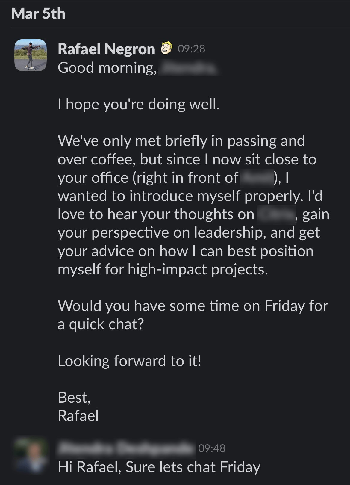

When I found out our engineering team was moving into a new building—and that I’d be sitting just a few feet from our Senior Vice President—I decided to take a shot. I sent him a Slack message, asked for a 1:1, and to my surprise… he said yes.

A few days later, we sat down for a candid conversation about career growth, leadership, and how to make the most of your time in a big tech company. Here’s what I learned:

---

## There is always a leadership vacuum.

You don’t need a title to lead. Great leadership is rare, and often the best way to grow is to fill the gaps no one else wants to. Be the person others can rely on.

## Raise your hand, help others, and over-deliver

Take on the tough stuff. Volunteer for the unknown. Mentor your teammates. The more value you give, the more opportunities will come back your way.

## Opportunities come out of nowhere at any time.

Plans are helpful, but preparation is better. Stay sharp in your current role, and when an unexpected door opens, you’ll be the first one they think of.

## Don't think company, think team.

Sometimes, it’s not the company that’s the issue—it’s the team. Look around internally before assuming you need to jump ship.

## Working faster is oftentimes better than planning too much.

Perfectionism kills progress. Build quickly, iterate often, and don’t get stuck in planning purgatory.

> "Fail fast, fail forward, fail often."

## Learn the business.

The best engineers understand the “why” behind the code. Ask questions. Understand the customer. You’ll build better—and be more valuable.

This conversation gave me a ton of clarity. My next step? Talking with the co-president of our organization.

---

Here is an embed of the original Reddit post and YouTube video related to the same topic.

<blockquote class="reddit-embed-bq" style="height:316px" data-embed-locale="en-EN" data-embed-height="316"><a href="https://www.reddit.com/r/cscareerquestions/comments/1jad1e2/i_recently_spoke_to_my_svp_of_engineering_heres/">I recently spoke to my SVP of engineering; here’s what I learned</a>  by<a href="https://www.reddit.com/user/entrasonics/">u/entrasonics</a> in<a href="https://www.reddit.com/r/cscareerquestions/">cscareerquestions</a></blockquote>

<iframe width="560" height="315" class="mt-5 w-full" src="https://www.youtube.com/embed/jtSYf1hYjFE?si=uzCWw3wXzzoIdHwm" title="YouTube video player" frameborder="0" allow="accelerometer; autoplay; clipboard-write; encrypted-media; gyroscope; picture-in-picture; web-share" referrerpolicy="strict-origin-when-cross-origin" allowfullscreen></iframe>
