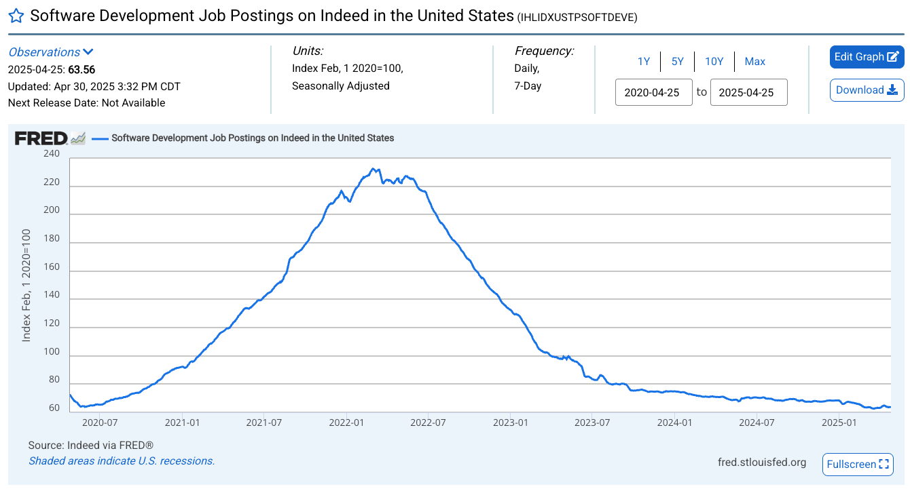

Everywhere you turn today, someone’s telling you to “escape the matrix.” Quit your 9-to-5. Build your empire. Go bigger. Go better. And if you like the stability of a full-time job? You're told you’re settling.

But here’s the thing: **I’ve been at the same company for eight years**. It’s the only full-time job I’ve had since graduating. I joined six weeks after finishing school, and I’m still here — and I love it.

In that time, I’ve grown personally and professionally. I’ve worked with some incredible people, taken on high-impact projects, grown into leadership, and even met my wife. So when people hear how long I’ve stayed, their reactions range from confused to shocked:

> “Eight years? What’s that like?”  
> “I could never be that loyal.”  
> “There’s so much out there — why stay?”  
> “Wow… lazy much?”

It’s wild how staying in one place can now feel like a radical act. But I’m here to share why it’s been one of the best career decisions I’ve made.

---

### The Gift of Job Stability

Let’s be honest — the software job market isn’t what it used to be.

After the COVID hiring spree, tech companies hit the brakes. Hard. Layoffs swept the industry, and even now, landing a new role — especially at the entry level — feels like threading a needle.

Meanwhile, I’ve been able to focus on leveling up where I am. I don’t spend my nights prepping for interviews or worrying about layoffs. Instead, I put that energy into building relationships, leading projects, and mentoring others.

That stability has been the launchpad for everything else in my life: learning new skills, getting promoted, and even finding hobbies I genuinely enjoy outside of work.

🧠 **If you’re focused on growth where you are, check out my promotion framework here**: [rafaelnegron.me/guide/guide-2](https://www.rafaelnegron.me/guide/guide-2)

---

### Real Career Progression Takes Time

A lot of people think of career growth as a ladder — but in many ways, it’s more like a **sawtooth wave**.

You work your way up, gain momentum, build credibility… and then you jump. New company, new team, new politics — and you start from scratch again. Rinse and repeat.

If you want to be truly effective — to influence roadmaps, coach junior engineers, shape culture — that requires time and trust. That requires context. And it doesn’t come with a job offer.

I’ve seen so many people leave just when things were about to click. Maybe they didn’t get what they wanted right away. Maybe they got bored. But they never gave themselves the time to see the long-term payoff of staying and investing.

---

### Deep Knowledge = Real Impact

At this point, I can explain how most systems at my company work — not just technically, but also in terms of business value. I know what matters to stakeholders. I know what pitfalls to avoid. I know the ghosts in the machine.

Why? Because I’ve lived it.

When you stay long enough, you don’t just **do** the work — you **own** the work. You become the go-to person, the mentor, the expert. That’s not just good for your ego — it’s good for your impact.

One of my proudest moments was being handed ownership of the UI codebase I had admired for years. I had studied it, worked on it, and slowly built the trust to take it over. It didn’t happen overnight. But when it did, it meant something.

---

### The Perks Compound Over Time

Let’s talk benefits — the stuff that often gets overlooked in the job-hop conversation.

#### 🔹 PTO

When I started, I had 20 days off per year. Five years later, it jumped to 25. Now we’ve got unlimited PTO, and I take around 30 days annually. Some of my former coworkers left before this perk was introduced — they never got to enjoy it.

#### 🔹 RSUs (Restricted Stock Units)

These aren’t instant cash-outs. They vest over time, and you often get more as you stick around. If you leave too early, you may forfeit thousands in long-term equity. Staying has allowed me to benefit from multiple refresher grants and the compounding power of stock over time.

#### 🔹 Bonuses

At my company, bonuses kick in at a certain level — in my case, as a Staff Engineer (IC4). Had I left earlier, I might’ve missed that threshold.

---

### Trust and Influence Matter More Than You Think

You can land a senior role on paper, but true influence is earned. People need to see how you work under pressure. How you handle failure. How you show up when no one’s watching.

There’s no shortcut for that.

These days, I help shape projects at the organizational level. I’m trusted. I’m respected. And I’ve earned that through consistency and long-term commitment — not a shiny résumé bullet.

---

### “But Aren’t You Just… Settling?”

Look, I get it. If you're not careful, comfort can turn into complacency.

But staying at one company doesn’t mean staying still. I’ve reinvented myself many times in the last eight years — taking on new projects, mentoring others, shifting tech stacks, and growing into a stronger version of myself.

The key is to **keep pushing** — not for the next job offer, but for better impact and better outcomes where you are.

---

### Final Thoughts

Everyone’s path is different. Some of my closest friends have switched jobs and flourished. I’m genuinely happy for them. But don’t let the loudest voices online make you feel like staying in one place is failure.

**Sometimes, staying is strategy.**

You’ll still face hard days. You’ll still have to work through conflict and change. But if you commit — really commit — you might be surprised at what you build.

And when you look back, it won’t feel like eight years.

It’ll feel like growth.

Peace ✌🏽

---

Want to see this topic come to life? Check out my latest YouTube video where I dive into this in detail — complete with examples, scenarios, and a few stories from my own career.

<iframe width="560" height="315" title="Everyone Told Me to Leave. I Stayed—and I’m Thriving." class="mt-5 w-full" src="https://www.youtube.com/embed/6OrRNGQD1dY?si=pukD0hCjdRhfE2bn" title="YouTube video player" frameborder="0" allow="accelerometer; autoplay; clipboard-write; encrypted-media; gyroscope; picture-in-picture; web-share" referrerpolicy="strict-origin-when-cross-origin" allowfullscreen></iframe>
