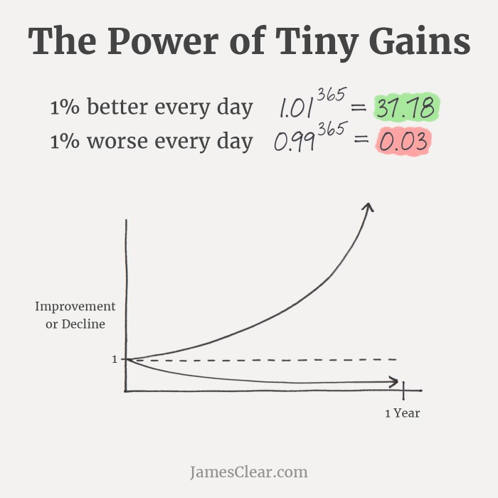

Workplace anxiety. It’s a feeling many of us know all too well. That overwhelming pressure that creeps in as you think about the mountain of tasks ahead. The doubt that lingers when you’re not sure if you’re performing well enough, or when you question whether you belong. It’s exhausting, right?

But here's the thing: workplace anxiety doesn’t have to hold you back. With the right mindset, small shifts in your approach, and a bit of structure, you can not only manage the anxiety but actually start making progress. So, let’s dive into a few ways you can handle workplace anxiety and start taking action—without the overwhelm.

## Focus on Yourself

First things first: You need to focus on you. Anxiety thrives when we get caught up in comparing ourselves to others, seeking constant validation, or overthinking what others think of us.

### Stop Comparing

We’ve all been there: looking around at coworkers, thinking they’ve got it all together while you’re struggling to keep up. But comparison doesn’t help. Everyone has their own unique journey, and the only person you should be comparing yourself to is your past self. Celebrate your progress, even if it feels slow.

### Let Go of External Validation

Sure, we all like a little praise now and then. But the truth is, you don’t need constant validation from others to know you’re doing a good job. Trust in the work you're putting in and in your abilities.

### Be Present

Anxiety feeds off thinking about the future and what could go wrong. Instead, focus on what you can do right now. Break your tasks into small, manageable pieces and take it one step at a time. The future can wait—today is where you have control.

### Build a Positive Mindset

It’s easy to fall into negative self-talk when anxiety creeps in. But shifting your internal dialogue can make a big difference. When the self-doubt starts, counter it with affirmations like, “I’m doing my best,” or “Mistakes are part of the process.” A positive mindset doesn’t make the anxiety go away completely, but it helps to quiet the inner critic.

## Set Clear, Actionable Goals

The next step to overcoming workplace anxiety is turning your energy into action. And what better way to do that than through goal-setting?

### Shift from Anxiety to Action

Instead of focusing on everything that could go wrong, start focusing on what you can do right now. Set one small goal for the day, whether it’s finishing a report or sending that email you’ve been avoiding. Taking action, even if it’s just a tiny step, gets you moving in the right direction.

### Set Small, Achievable Goals

Don’t overwhelm yourself with a long to-do list. Start with just one or two things that are realistic to accomplish in a day. Checking off even small tasks can boost your confidence and momentum.

### Measure Your Progress

The key to fighting anxiety is to have some concrete evidence of progress. Keep track of your achievements, no matter how small. The more you measure your progress, the more you can see that you are indeed moving forward, and that can help ease those anxious feelings.

### Use Deadlines Wisely

Deadlines are often seen as a source of pressure, but they can actually help you stay on track. Use them as motivation to focus your energy. If you miss one, don’t beat yourself up. Learn from it, adjust, and keep going.

## Start Measuring Yourself

When anxiety strikes, it often comes from uncertainty—uncertainty about how you’re doing or where you stand. That’s where regular feedback comes in.

### Seek Feedback Regularly

Instead of wondering how you’re doing, ask. Regular feedback helps you stay on track and know exactly where you stand. It’s also a great way to clear up any confusion or anxiety about your performance.

### Ask Clear Questions

Instead of vaguely asking “How am I doing?” try asking more specific questions like, “Is there anything I can improve on with my recent project?” This clarity will help you get actionable feedback and reduce the uncertainty that fuels anxiety.

### Reframe Feedback as Growth

Feedback isn’t a judgment—it’s an opportunity for growth. Instead of seeing feedback as criticism, try reframing it as a chance to improve. This shift in perspective helps you see feedback as a tool, not a threat.

### “No News” Is Usually Good News

Often, silence from your boss or team means that things are going well. If they had issues with your performance, they’d bring it up. So, take the quiet moments as a sign that you’re on the right track.

## Diversify Your Joy

Workplace anxiety becomes even worse when you tie your entire sense of self-worth to your job. You are not just your work—you are a multifaceted person with many interests, passions, and relationships outside the office. The more you can cultivate joy beyond work, the more you’ll be able to manage anxiety when it arises.

### Find Meaning Outside of Work

What brings you joy outside your job? Whether it’s family, friends, hobbies, or personal goals, having something meaningful outside of work will help ground you. It reminds you that you’re not just defined by your job title.

### Build Hobbies and Social Connections

Get out there and explore interests that don’t relate to your work. Whether it's a sport, reading, or volunteering, having something that fills you up outside of the office can provide a sense of fulfillment and help reduce work anxiety.

### Celebrate Non-Work Wins

You don’t need a promotion or a big project win to celebrate. Maybe you cooked a great meal or had a great conversation with a friend—celebrate those moments. Small wins outside of work can boost your mood and remind you that you’re doing great, no matter what’s happening in the office.

### Avoid the Work = Identity Trap

Work shouldn’t be the only thing that defines you. If you start to lose yourself in your job, you’re more vulnerable to burnout and anxiety. Find balance by investing in other areas of your life. Your job is just one piece of the puzzle.

## In Conclusion

Workplace anxiety is tough, but it doesn’t have to take over your life. By focusing on yourself, setting clear goals, seeking feedback, and diversifying your sources of joy, you can turn anxiety into action and build a more grounded, balanced career. Remember, it’s all about small, intentional steps.

You’ve got this. Keep moving forward, one goal at a time.

---

<iframe width="560" height="315" class="mt-5 w-full" src="https://www.youtube.com/embed/41rjxzQl1VE?si=1w4nWq0RDKhjwCbe" title="YouTube video player" frameborder="0" allow="accelerometer; autoplay; clipboard-write; encrypted-media; gyroscope; picture-in-picture; web-share" referrerpolicy="strict-origin-when-cross-origin" allowfullscreen></iframe>
